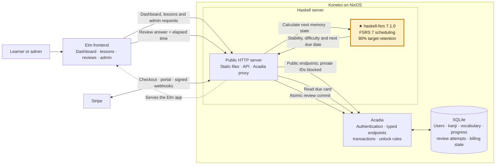

# Koneko Architecture Haskell blog post

```mermaid
flowchart LR
    Reader["Learner or admin"] --> Elm["Elm frontend<br/>Dashboard · lessons · reviews · admin"]

    subgraph Host["Koneko on NixOS"]
        subgraph Haskell["Haskell server"]
            API["Public HTTP server<br/>Static files · API · Acadia proxy"]
            FSRS["★ haskell-fsrs 7.1.0<br/>FSRS 7 scheduling<br/>90% target retention"]
        end

        Acadia["Acadia<br/>Authentication · typed endpoints<br/>transactions · unlock rules"]
        SQLite[("SQLite<br/>Users · kanji · vocabulary · progress<br/>review attempts · billing state")]
    end

    Elm -->|"Dashboard, lessons and admin requests"| API
    Elm -->|"Review answer + elapsed time"| API
    API -->|"Public endpoints; private IDs blocked"| Acadia
    API -->|"Read due card"| Acadia
    API -->|"Calculate next memory state"| FSRS
    FSRS -->|"Stability, difficulty and next due date"| API
    API -->|"Atomic review commit"| Acadia
    Acadia <--> SQLite

    Stripe["Stripe"] <-->|"Checkout · portal · signed webhooks"| API
    API -.->|"Serves the Elm app"| Elm

    classDef highlight fill:#fff1c7,stroke:#c47f00,stroke-width:3px,color:#272016
    class FSRS highlight
```
